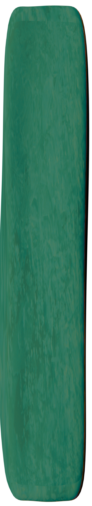
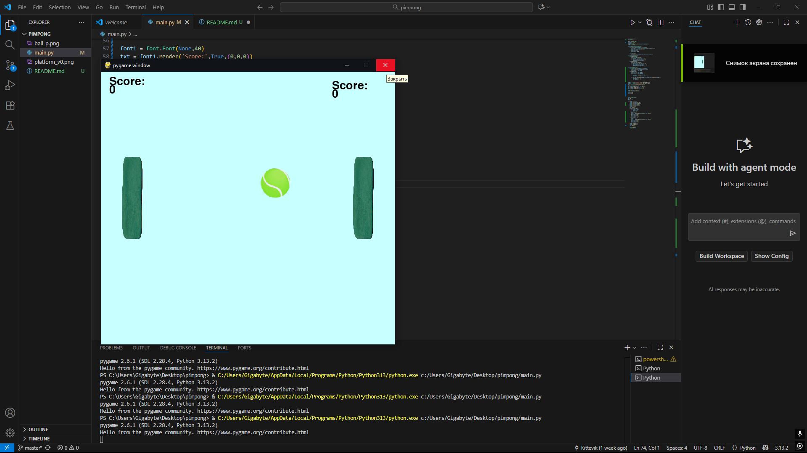

ну короче тут вот ну есть вроде 3 спрайта как я помню двоеточие:
мячик


ракетки



внешка игры ну ты понял


разраб:
меня никита зовут

короче играть не сложно там сразу начинается

wasd левая ракетка

стрелочки правая ракетка

# Fast Start:
```bash
python -m main.py
```
привет


